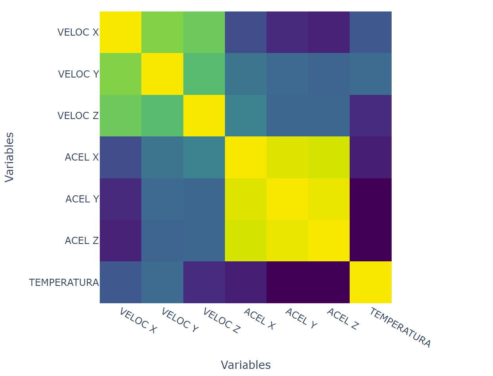
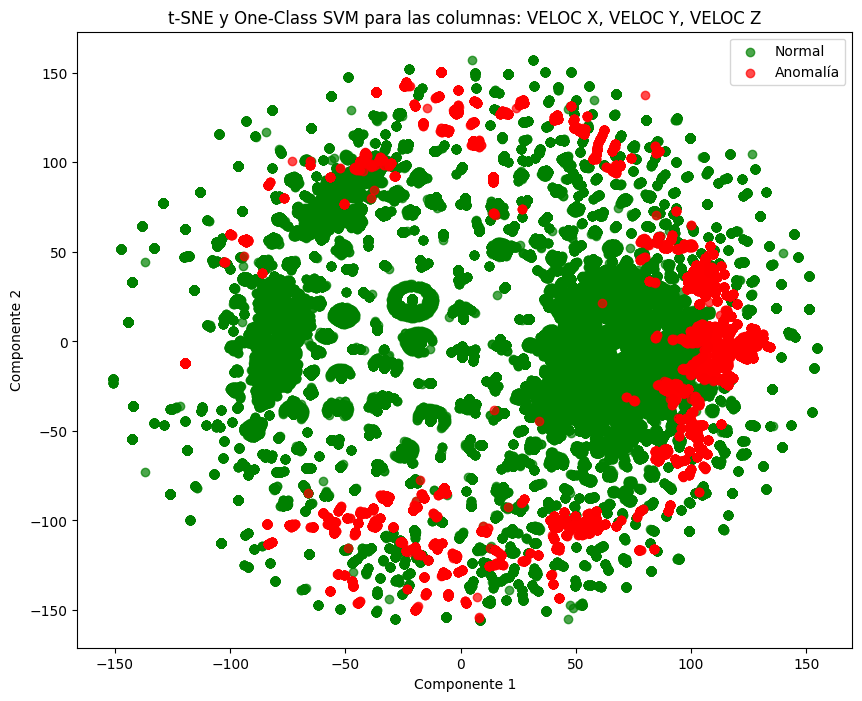
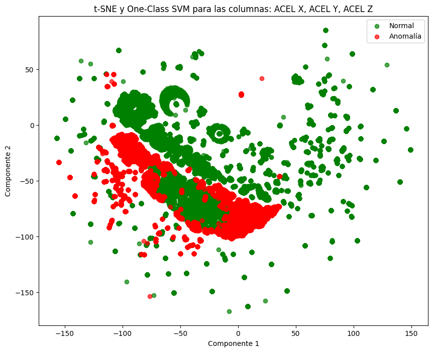
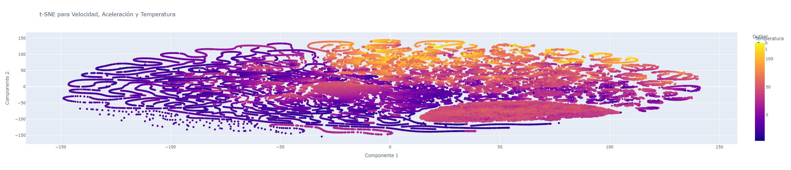
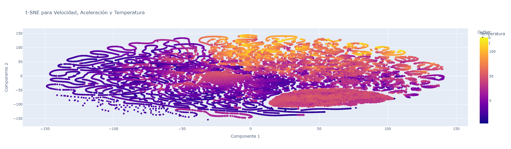

# Unsupervised Anomaly Detection with OC-SVM for Predictive Maintenance

This repository contains the Jupyter Notebooks developed as 
part of my master’s thesis in Data Science at Universidad San Francisco de Quito (USFQ). The project focuses on applying **unsupervised learning techniques** for detecting anomalies in industrial rotating machinery using **One-Class Support Vector Machines (OC-SVM)**.

## Description

The data was collected from a **Dynamox sensor** installed on a motor with a gear-reducing unit. The sensor measures temperature, velocity, and acceleration across three axes. The aim was to identify early signs of mechanical anomalies based on deviations in these signals — even in the absence of labeled fault data.

To do this, I applied OC-SVM models on preprocessed sensor data, evaluated different hyperparameter configurations, and used **t-SNE** to visualize the separation between normal and anomalous behavior.

## Notebooks

- `Tesis1.ipynb`: Initial version of the modeling pipeline.
- `tesis2.ipynb`: Final version, includes preprocessing, parameter tuning, and evaluation metrics.

## Highlights

- Real industrial dataset (176,000+ records)
- Preprocessing: handling missing values, standardization
- Model: One-Class SVM for unsupervised anomaly detection
- Evaluation: precision, recall, F1-score (with synthetic labels)
- Visual exploration with t-SNE projections

## About the Author

**Lenin Salinas**  
Master’s in Data Science  
Universidad San Francisco de Quito – USFQ  
April 2025

The repository includes visual aids to support the interpretation of results. These are stored in the `figures/` folder and include:

### 🔹 Correlation Heatmap
A matrix of Pearson correlations across all sensor variables.

---

### 🔹 OC-SVM + t-SNE (Velocity data)
t-SNE projection of the data using only velocity features. Green: normal data, Red: anomalies.

---

### 🔹 OC-SVM + t-SNE (Acceleration data)
A different view using acceleration features.

---

### 🔹 Temperature-based t-SNE Visualizations
Cluster structure and thermal variation are visualized using continuous color maps.

---
